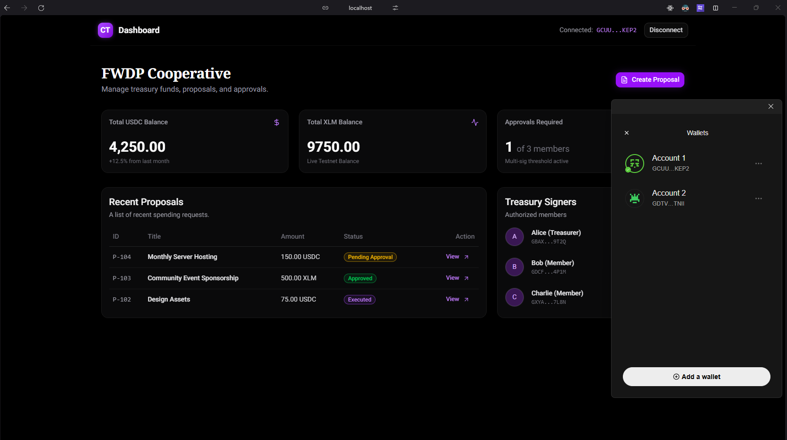
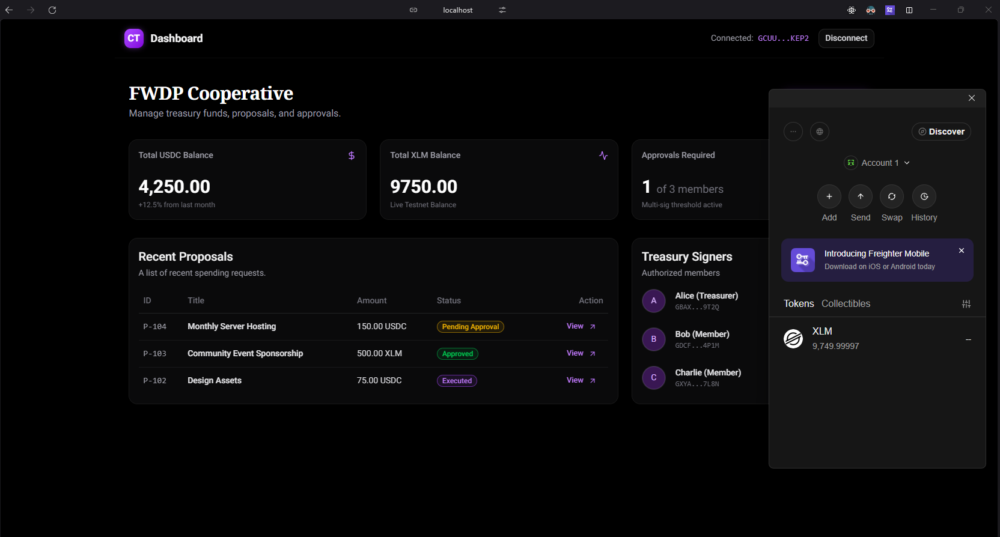
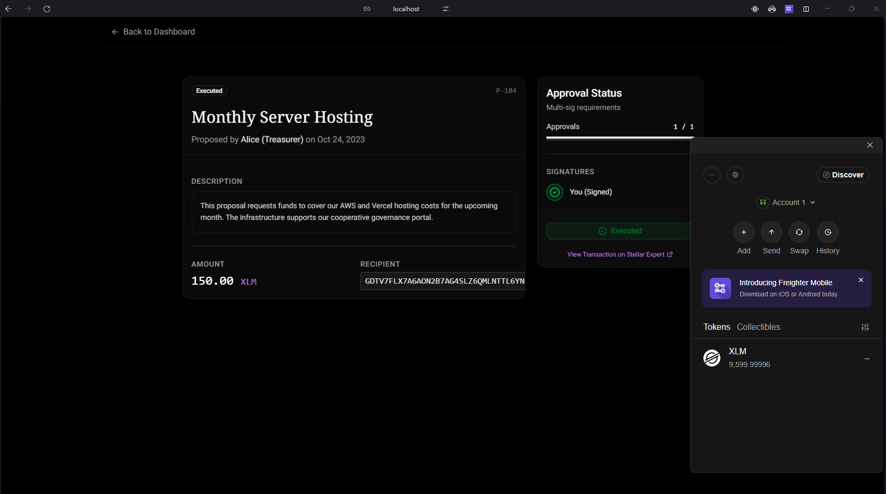
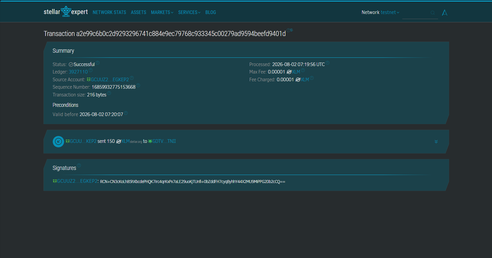

# Cooperative Treasury

## What is Cooperative Treasury?
Cooperative Treasury is a Web3-powered governance and treasury management platform designed for decentralized cooperatives and DAOs. Built on the Stellar network, it enables transparent and secure multi-signature (multi-sig) funds management. Members can seamlessly connect their Stellar wallets, propose expenditures, vote on community initiatives, and collectively execute transactions on the blockchain. 

With a beautiful, glassmorphic UI built in Next.js, the Cooperative Treasury simplifies the complex workflows of decentralized finance (DeFi) into an intuitive dashboard.

### Key Features
- **Stellar Wallet Integration:** Secure login and transaction signing via the Freighter browser extension.
- **Live Treasury Dashboard:** Track live XLM and USDC balances directly from the Stellar Horizon Testnet.
- **Proposal Workflow:** Create, review, and approve spending proposals.
- **Multi-sig Execution:** Automatically construct and submit multi-signature transactions to the Stellar network once approval thresholds are met.

## Tech Stack
- **Frontend Framework:** Next.js (App Router), React
- **Styling & UI:** Tailwind CSS, shadcn/ui, Framer Motion
- **State Management:** Zustand
- **Web3 Integration:** `@stellar/stellar-sdk`, `@stellar/freighter-api`

## White Belt Submission Screenshots:

### Wallet Connected State


### Balance displayed


### Successful testnet transaction


### The transaction result is shown to the user


---

## Local Development Setup

Follow these instructions to set up and run the Cooperative Treasury locally on your machine.

### Prerequisites
1. **Node.js**: Ensure you have Node.js (v18 or higher) installed.
2. **Freighter Wallet**: Install the [Freighter browser extension](https://www.freighter.app/) to interact with the dApp.
3. **Stellar Testnet Account**: Create and fund a testnet account within Freighter. (You can fund it via the Freighter settings or the [Stellar Laboratory Faucet](https://laboratory.stellar.org/#account-creator)).

### Installation

1. **Clone the repository** (or navigate to your working directory):
   ```bash
   git clone https://github.com/FWDP/cooperative-treasury.git
   cd cooperative-treasury
   ```

2. **Install dependencies**:
   ```bash
   npm install
   ```

3. **Start the development server**:
   ```bash
   npm run dev
   ```

4. **View the App**:
   Open [http://localhost:3000](http://localhost:3000) in your browser. 

### Testing the Workflow
1. Click **Connect Wallet** on the landing page and approve the connection in Freighter.
2. You will be redirected to the Dashboard where your live testnet XLM balance will be displayed.
3. Click "View" on any proposal, simulate an approval, and click "Ready to Execute" to test the Stellar transaction flow!

---
*Built with Next.js and Stellar.*
